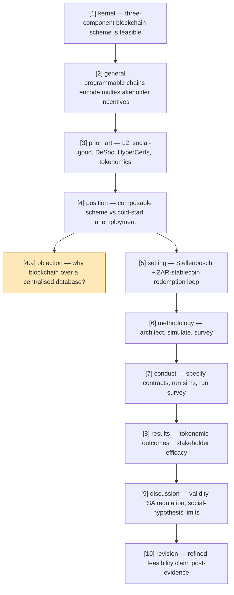

# A three-component blockchain scheme of learner XP tokens, soulbound credentials, and educator HyperCerts is technically feasible for incentivising market-linked upskilling against structural unemployment

## Tree

- **[1]** kernel — A three-component blockchain scheme of learner XP tokens, soulbound credentials, and educator HyperCerts is technically feasible for incentivising market-linked upskilling against structural unemployment.
  - **[2]** general — Programmable application-layer blockchains can encode multi-stakeholder incentive structures targeting socio-economic problems where supply-side interventions alone have proven insufficient.
    - **[3]** prior_art — Ethereum L2 maturity, blockchain-for-social-good frameworks, decentralized society credentials (Weyl 2022), HyperCerts (Dalrymple 2022), and tokenomics design frameworks.
      - **[4]** position — Combining fungible learner XP tokens, soulbound credentials, and educator HyperCerts into one composable scheme operationalises blockchain-for-social-good against the cold-start unemployment dynamic.
        - **[4.a]** ★ branch:objection from [4] — A centralised database with API access could implement the same incentive flows at lower cost and regulatory friction, undermining the necessity of blockchain.
        - **[5]** setting — Stellenbosch labour market with underprivileged learners, employer-educators, vendors, municipalities, and CSR funders coordinating through a ZAR-stablecoin redemption loop.
          - **[6]** methodology — Architect each component, simulate the integrated tokenomics under chosen parameters, and survey stakeholders on perceived efficacy of the resulting scheme.
            - **[7]** conduct — Specify ERC selections and contract logic, run parametric simulations of token velocity, redemption pressure, and educator rewards, and administer the stakeholder survey.
              - **[8]** results — Report measured tokenomic outcomes against the design requirements and surface stakeholder-perceived efficacy of the scheme for unemployment intervention.
                - **[9]** discussion — Interpret feasibility under threats to validity, South African regulatory constraints (SARB / FSCA / KYC-AML), and limits imposed by the assumed social hypothesis.
                  - **[10]** revision — Refined claim about the technical feasibility of the three-component scheme once simulation and survey evidence are integrated.

## Mermaid

## Notes

[1] Kernel framed as a technical-feasibility claim per main.tex §I: "the focus of this paper is on the technical feasibility of such a system, making the large assumption that the [social] hypothesis is true."
[5] The setting is shared by the simulation (§IV) and the survey (§V); a `branch 5 alternative` would split them.
[4.a] The "why blockchain" objection is the load-bearing reviewer pushback at the position rung; rebut via decentralisation, capture-resistance, composability with HyperCerts/DeSoc primitives, and credible neutrality of the credential layer (cf. main.tex §I framing of Ethereum's persistence/auditability).

## Expansions

[4.a] -> ./expansions/4a-objection.md  (for/against blockchain vs centralised database; learner XP, credential permanence, real-time)
