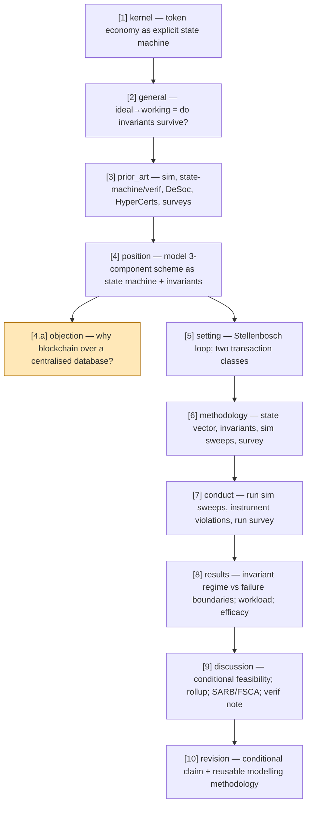

# Modelling a permissionless social-good token economy as an explicit state machine exposes the invariants and failure modes that separate an ideal design from a deployable one

## Tree

- **[1]** kernel — Modelling a permissionless social-good token economy (upskilling incentives) as an explicit state machine exposes the invariants and failure modes that separate an ideal design from a deployable one.
  - **[2]** general — Translating ideal permissionless mechanisms for social problems into working systems hinges on whether economic invariants survive adversarial, multi-stakeholder dynamics — a modelling problem, not just engineering.
    - **[3]** prior_art — Tokenomics simulation (cadCAD / agent-based / mechanism design), state-machine & contract specification (TLA+, SMTChecker, Certora), DeSoc credentials (Weyl 2022), HyperCerts (2022→present), blockchain-for-social-good, and survey methods for system efficacy.
      - **[4]** position — Model the three-component scheme (learner XP, soulbound credentials, educator HyperCerts) as an explicit state machine — joint state of balances, reserves, pending redemptions, entitlements, credential/claim status — with formal invariants and enumerated failure modes.
        - **[4.a]** ★ branch:objection from [4] — A centralised database with API access could implement the same incentive flows at lower cost and regulatory friction, undermining the necessity of blockchain.
        - **[5]** setting — Stellenbosch ZAR-stablecoin redemption loop as the parameterisation source: the agents (learners, employer-educators, vendors, municipalities, CSR funders), the flows, and the two transaction classes (rare high-value impact claims vs. frequent low-value learner→vendor transfers).
          - **[6]** methodology — Specify the state vector and transition set; define invariants (solvency, bounded issuance, uniqueness/non-duplication, liveness of redemption) and failure modes; simulate across parameter sweeps; survey stakeholders on perceived efficacy.
            - **[7]** conduct — Implement the state-machine simulation, sweep issuance/redemption/velocity parameters, instrument invariant violations and failure-mode onset, and administer the stakeholder survey.
              - **[8]** results — Map the invariant-preserving regime vs. each failure mode's trigger boundary; characterise the two-transaction-class workload; report stakeholder-perceived efficacy.
                - **[9]** discussion — Conditional feasibility (feasible within bounds X); failure-mode lessons for permissionless social-good economies; rollup/data-availability deployment choice implied by the workload; SARB/FSCA stablecoin constraints; contract verification (SMTChecker/Certora) as a feasibility note; threats to validity.
                  - **[10]** revision — Refined *conditional* feasibility claim plus a reusable methodology for modelling and stress-testing permissionless social-good token economies.

## Mermaid

```mermaid
graph TD
  N1["[1] kernel — token economy as explicit state machine"]
  N2["[2] general — ideal→working = do invariants survive?"]
  N3["[3] prior_art — sim, state-machine/verif, DeSoc, HyperCerts, surveys"]
  N4["[4] position — model 3-component scheme as state machine + invariants"]
  N4a["[4.a] objection — why blockchain over a centralised database?"]:::branch
  N5["[5] setting — Stellenbosch loop; two transaction classes"]
  N6["[6] methodology — state vector, invariants, sim sweeps, survey"]
  N7["[7] conduct — run sim sweeps, instrument violations, run survey"]
  N8["[8] results — invariant regime vs failure boundaries; workload; efficacy"]
  N9["[9] discussion — conditional feasibility; rollup; SARB/FSCA; verif note"]
  N10["[10] revision — conditional claim + reusable modelling methodology"]
  N1 --> N2 --> N3 --> N4 --> N5 --> N6 --> N7 --> N8 --> N9 --> N10
  N4 --> N4a
  classDef branch fill:#ffe8b8,stroke:#aa6b00;
```

## Notes

[1] The kernel pivoted (2026-06-01) from a flat technical-feasibility claim to a state-machine modelling claim, following supervisor direction (see ./feedback/supervisor-direction.md, points 3 & 4). The contribution is now the *model + the conditional-feasibility map + the methodology*, not the architecture as an existence proof.
[2] This is the sentence the background should march the reader to: the ideal→working gap for permissionless social mechanisms *is* the set of economic invariants that may or may not survive adversarial, multi-stakeholder dynamics — and that gap is measurable.
[3] Background section maps to [2]+[3]. New literature load vs. the old path: tokenomics simulation methodology (cadCAD, agent-based, mechanism design), state-machine / formal specification, and survey methods. Verification tooling (SMTChecker/Certora) is cited lightly — mention-only, not a pillar. HyperCerts must be updated from the 2022 white-paper to the current landscape.
[4] State vector (per supervisor): learner balances, vendor claims, treasury reserves, pending redemptions, educator reward entitlements, credential status, outstanding impact claims. Transitions: milestone completion, course completion, vendor redemption, treasury refill, educator reward issuance, impact-fraction purchase, dispute/revocation, expiry/dormancy.
[4.a] The "why blockchain" objection is now *answered* by the pivot rather than merely defended: the invariants must be enforced by contract code under permissionless, adversarial, multi-operator conditions — a trusted-operator database sidesteps the hard problem instead of solving it. Rebut via decentralisation, capture-resistance, composability with HyperCerts/DeSoc primitives, and credible neutrality of the credential layer. This is also what makes contract verification (SMTChecker/Certora) relevant.
[5] Setting now does double duty: it parameterises the model *and* supplies the two transaction classes (folded into the trunk per supervisor point 4). Core invariants: solvency, bounded issuance, uniqueness/non-duplication, liveness of redemption. Core failure modes: reserve shortfall, dead-token hoarding, circular milestone farming, educator over-issuance, vendor concentration, adverse velocity spikes decoupling circulation from learning outcomes.
[6] Mixed-methods retained: simulation is the primary method; the stakeholder survey triangulates perceived efficacy. Background must therefore also cover survey methodology and its validity threats.
[8] Workload characterisation (rare high-value impact claims vs. frequent low-value transfers) is a first-class output here, feeding the rollup/data-availability discussion in [9].

## Expansions

[4.a] -> ./expansions/4a-objection.md  (for/against blockchain vs centralised database; learner XP, credential permanence, real-time)
